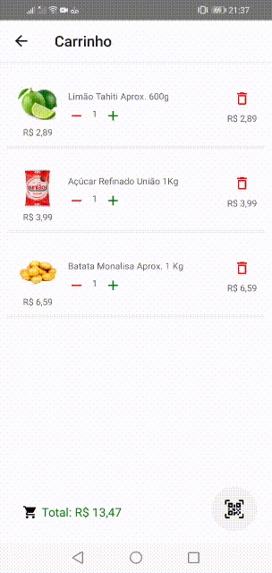
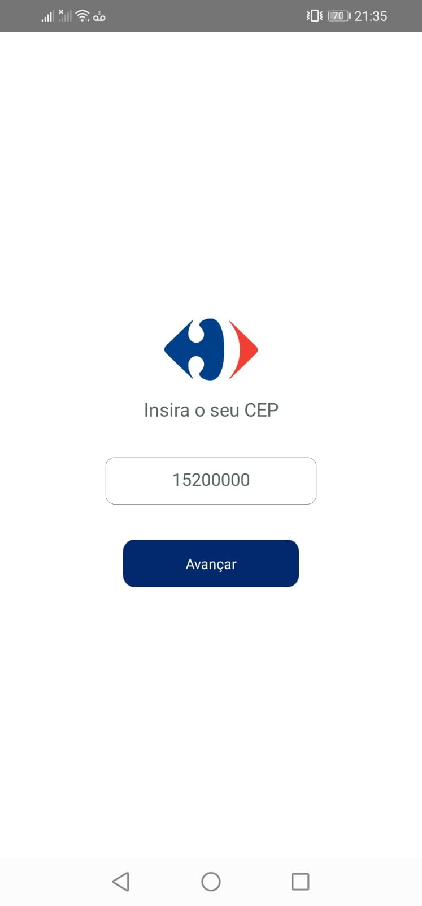
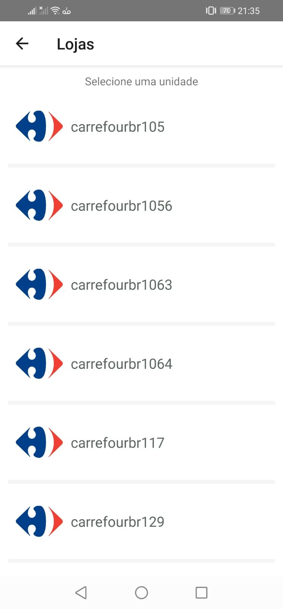
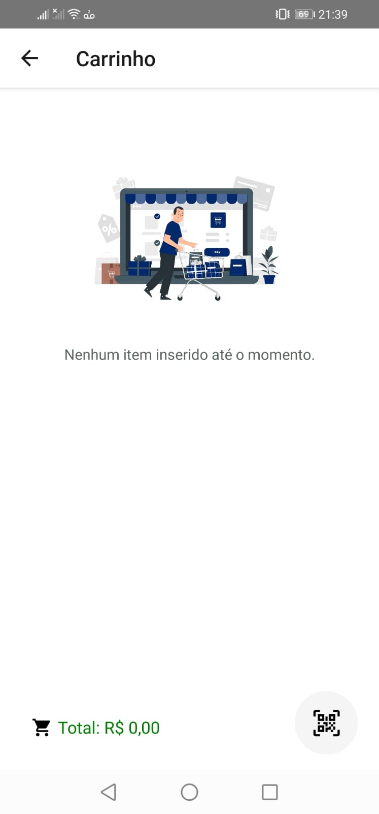
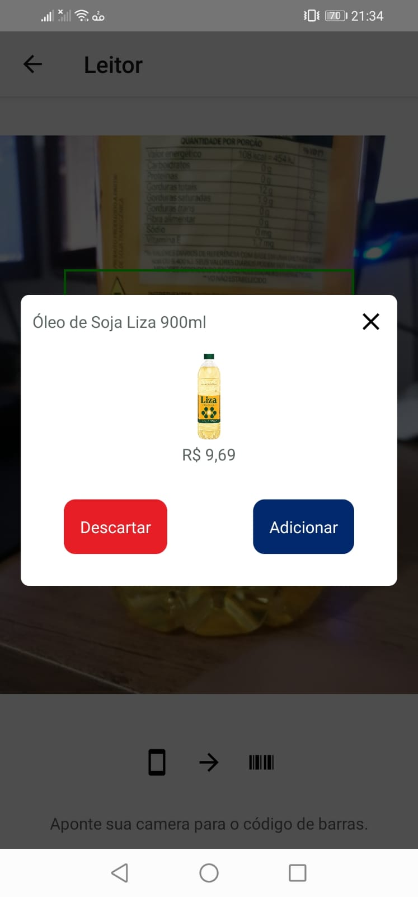
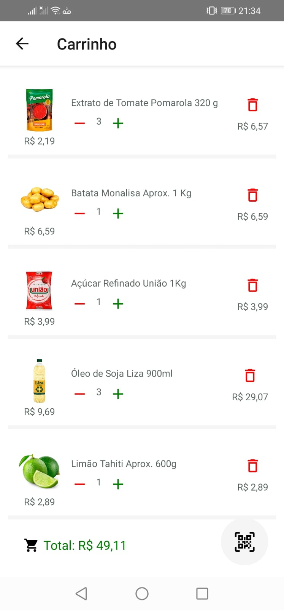

# App Digital Cart

### Projeto desenvolvido especialmente para o Carrefour Tech Day.

O aplicativo funciona como uma espécie de carrinho virtual, sendo possível consultar detalhes da mercadoria via leitura de código de barras e a montagem da representação virtual do seu carrinho de compras.

## API Carrefour

https://mercado.carrefour.com.br/api/checkout/pub/regions?country=BRA&postalCode={CEP}

https://mercado.carrefour.com.br/api/catalog_system/pub/products/search?fq={id}

## Layout da Aplicação

  
  

  

  
  
   
    
     

<h2>🛠 Tecnologias Utilizadas</h2>

<ul>
    <li>React Native</li>
</ul>
